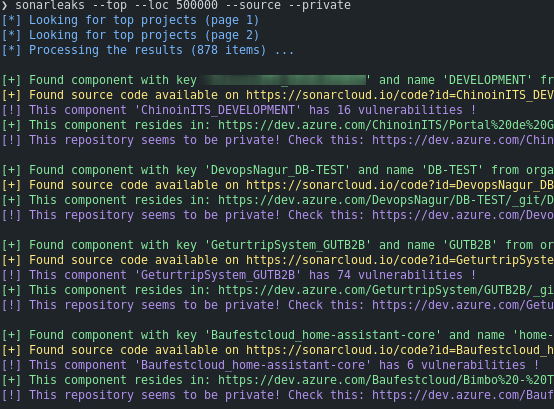
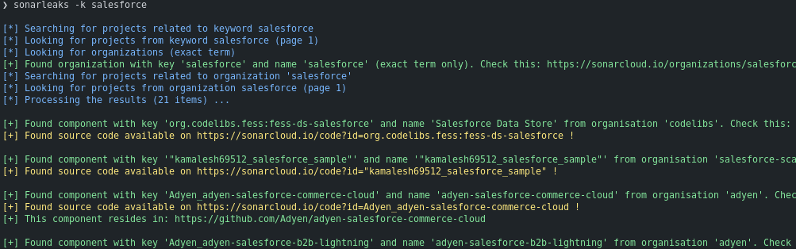

# Sonarleaks


## Summary

SonarCloud is a SAST SaaS platform built onto SonarQube.

During my DevSecOps journey, I recently discovered that [Sonarcloud](https://sonarcloud.io/) (From SonarSource) offers the possibility to explore public projects.
After working on [Postleaks](https://github.com/cosad3s/postleaks) and popularity of some other similars projects (like [swaggerHole](https://github.com/Liodeus/swaggerHole)) related to public data on SaaS, the `Explore` button triggers my curiosity.

I created this small tool to get basic infos about Sonarcloud projects from the `Explore` tab. Some of them **are from private source repository, or can be related to a company which misconfigured the repository visibility**.  
**It becomes juicy when the results provides the source code AND the static analysis.**


## Usage

```bash
❯ sonarleaks -h
usage: sonarleaks [-h] [--top] [--loc LOC] [-k KEYWORD] [-kf KEYWORD_FILE] [--private] [--source]

Sonarleaks 🛰️💧 Search for private code published to Sonarcloud.

options:
  -h, --help        show this help message and exit
  --top             Filter on top public projects
  --loc LOC         Filter on minimum of lines of code
  -k KEYWORD        Keyword (company, project, etc.)
  -kf KEYWORD_FILE  Keywords file
  --private         Only display components linked to potential private repository.
  --source          Only display components with available source code.
```

### Examples

***Top public projects, with minimum 500000 lines of code, with private repository and source code available***

`❯ sonarleaks --top --loc 500000 --source --private`



***Projects related to keyword `Salesforce`***

`❯ sonarleaks -k salesforce`


